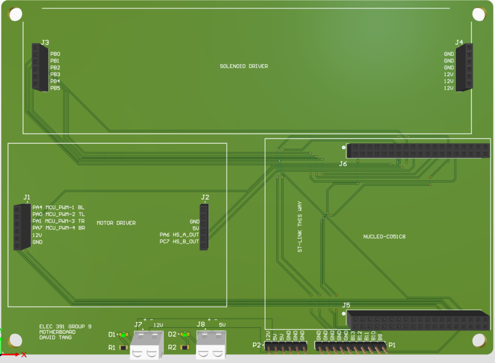
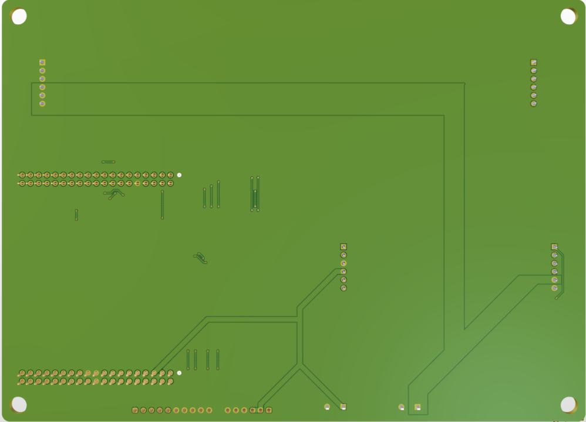
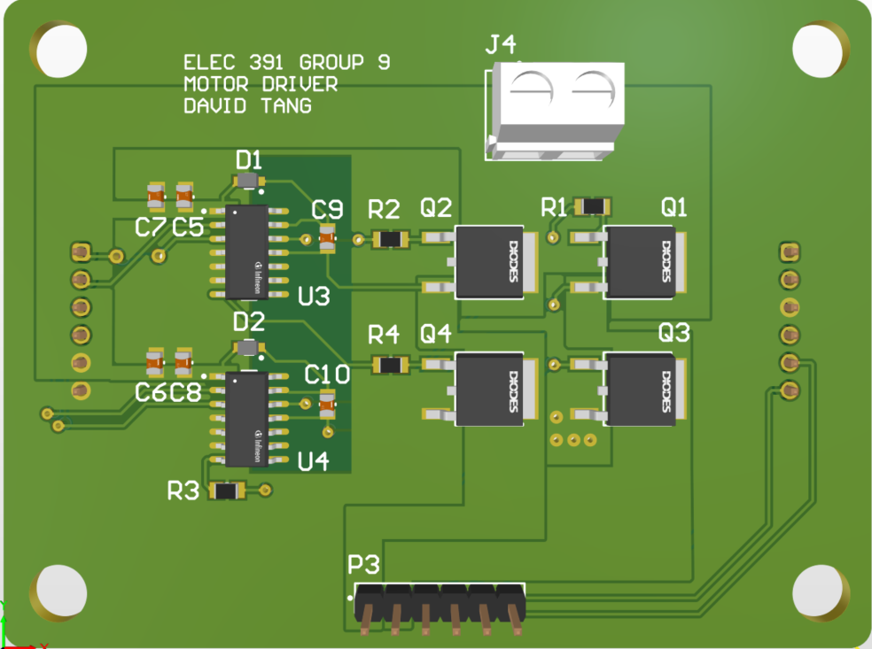
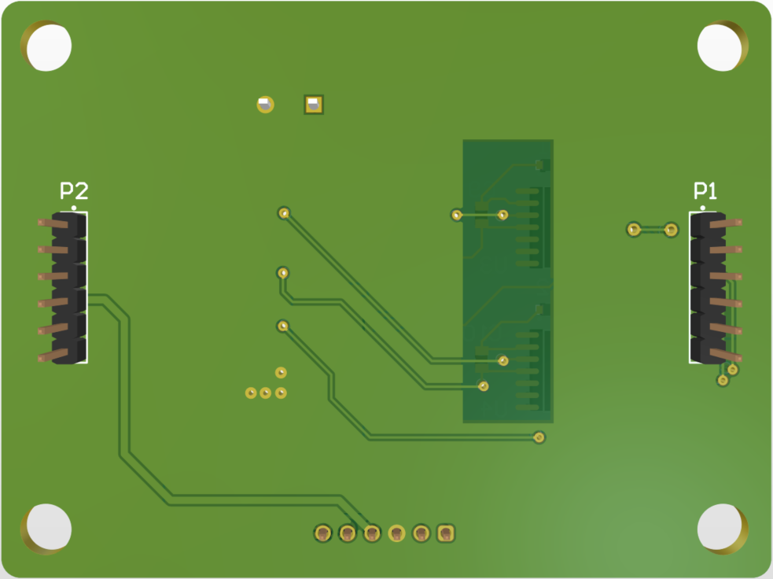

# Robot-Piano-Player-PCBs
Motherboard and Motor Driver Board for the ELEC 391 Robot Piano Player Project. Boards designed by David Tang for Group 9.

## Group 9 Robot Piano Player

  
  

## Motherboard 
A centralized power and signal distribution board designed for simplicity and modular operation with all robot daughter boards.
- Compact 2-layer design (130x180 mm) for simplicity in manufacturing
- Facilitates connections between all driver boards (Motor, Solenoid) to a NUCLEO-C051C8 board through the use of 2.54mm female socket headers
- Dual 16-30 AWG screw terminal blocks for power supply interfacing with 12 V & 5 V rails
- Dual sets of 1x6 2.54 mm male header pins for spare GPIO and power connections for peripherals
- Onboard 0805 green smd LEDs for user debugging

  
  

## Motor Driver Board
A dedicated H-bridge driver board for brushed DC motors
- Compact 2-layer design (60x80 mm) for simplicity in manufacturing
- Dual half-bridge gate driver ICs (IRS21084) and 4 N-channel MOSFETs supporting 12V brushed DC motors up to 4 A
- Void copper region under bootstrap pins to reduce parasitic capacitance and improve switching performance
- 3 1x6 male header pins for PWM control, encoder signals, and motor power connections

  
  

